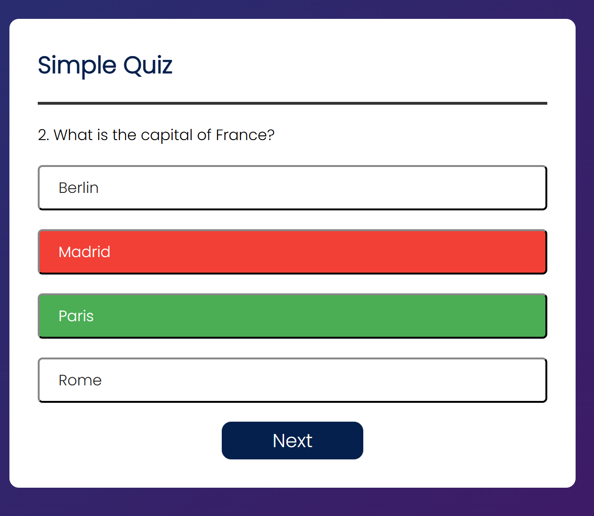

# Quiz Website

A simple, interactive quiz application built with HTML, CSS, and JavaScript. This project allows users to answer multiple-choice questions and displays their score at the end of the quiz.

## Features

- Displays a series of multiple-choice questions.
- Highlights correct and incorrect answers after selection.
- Keeps track of the user's score.
- Displays the final score at the end of the quiz.
- Option to restart the quiz.

## Technologies Used

- **HTML**: For structuring the webpage.
- **CSS**: For styling the quiz interface.
- **JavaScript**: For quiz functionality and interactivity.

## Project Structure

## How to Run the Project

1. Clone or download the repository to your local machine.
2. Open the `index.html` file in any modern web browser.
3. The quiz will load, and you can start answering the questions.

## How It Works

1. The quiz starts with the first question displayed.
2. Users select an answer by clicking on one of the buttons.
3. The selected answer is highlighted as correct (green) or incorrect (red).
4. The "Next" button appears after selecting an answer.
5. After answering all questions, the final score is displayed.
6. Users can restart the quiz by clicking the "Restart" button.

## Code Highlights

### JavaScript Logic

- **Question Handling**: Questions and answers are stored in an array of objects in `script.js`.
- **Answer Validation**: The `selectedAnswer` function checks if the selected answer is correct and updates the score.
- **Dynamic UI Updates**: The `resetState` and `showQuestion` functions dynamically update the quiz interface.

### CSS Styling

- The quiz interface is styled using Flexbox for centering and responsiveness.
- Buttons change color on hover and when selected to indicate correctness.

## Future Improvements

- Add a timer for each question.
- Include more questions and categories.
- Make the quiz mobile-friendly with responsive design.
- Store scores using local storage or a backend database.

## License

This project is open-source and available under the [MIT License](https://opensource.org/licenses/MIT).

## Screenshots

---

Feel free to contribute to this project by submitting issues or pull requests!